# HiBeats Professional Architecture Diagram

## System Architecture Overview

HiBeats is a comprehensive Web3 decentralized music platform that integrates AI-powered music generation, NFT marketplace functionality, social networking features, and advanced blockchain infrastructure. The platform enables creators to generate music using artificial intelligence, mint them as NFTs, trade on a built-in marketplace, and build communities around their music.

## Core Architecture Layers

```mermaid
graph TB
    subgraph "Presentation Layer"
        direction TB
        UI["🎨 React Frontend<br/>- TypeScript<br/>- Vite Build<br/>- Responsive Design"]
        ROUTER["🔀 Navigation<br/>- React Router<br/>- Protected Routes<br/>- Deep Linking"]
        COMPONENTS["🧩 UI Components<br/>- Shadcn/UI<br/>- Radix Primitives<br/>- Tailwind CSS"]
    end

    subgraph "Application Layer"
        direction TB
        STATE["📊 State Management<br/>- Wagmi (Web3)<br/>- TanStack Query<br/>- SWR (Real-time)"]
        HOOKS["🔗 Custom Hooks<br/>- useWallet<br/>- useNFTMetadata<br/>- useMarketplace"]
        SERVICES["⚙️ Service Layer<br/>- Web3Service<br/>- IPFSService<br/>- AIService"]
    end

    subgraph "Integration Layer"
        direction TB
        WEB3["⛓️ Blockchain Layer<br/>- Wagmi<br/>- Viem<br/>- Ethers.js"]
        STORAGE["📁 Storage Layer<br/>- IPFS/Pinata<br/>- Metadata<br/>- Audio Files"]
        AI["🤖 AI Integration<br/>- Suno API<br/>- Music Generation<br/>- Audio Processing"]
    end

    subgraph "Smart Contract Ecosystem"
        direction TB
        CORE["🏭 Core Contracts<br/>- Factory<br/>- NFT (ERC-721)<br/>- Token (ERC-20)"]
        MARKET["🛒 Marketplace<br/>- Trading<br/>- Auctions<br/>- Royalties"]
        SOCIAL["👥 Social Layer<br/>- Profiles<br/>- Interactions<br/>- Discovery"]
        DEFI["💰 DeFi Features<br/>- Staking<br/>- Governance<br/>- Analytics"]
    end

    subgraph "External Services"
        direction TB
        BLOCKCHAIN["🌐 Blockchain Network<br/>- Somnia Testnet<br/>- EVM Compatible<br/>- Gas Optimization"]
        IPFS_NET["📡 IPFS Network<br/>- Decentralized Storage<br/>- Content Addressing<br/>- Redundancy"]
        AI_SERVICES["🎵 AI Services<br/>- Suno API<br/>- Music Generation<br/>- Audio Processing"]
    end

    %% Connections
    UI --> STATE
    ROUTER --> STATE
    COMPONENTS --> HOOKS
    STATE --> SERVICES
    HOOKS --> SERVICES
    SERVICES --> WEB3
    SERVICES --> STORAGE
    SERVICES --> AI
    WEB3 --> CORE
    WEB3 --> MARKET
    WEB3 --> SOCIAL
    WEB3 --> DEFI
    STORAGE --> IPFS_NET
    AI --> AI_SERVICES
    CORE --> BLOCKCHAIN
    MARKET --> BLOCKCHAIN
    SOCIAL --> BLOCKCHAIN
    DEFI --> BLOCKCHAIN

    %% Styling
    classDef presentation fill:#e3f2fd,stroke:#1565c0,stroke-width:2px,color:#000
    classDef application fill:#f1f8e9,stroke:#388e3c,stroke-width:2px,color:#000
    classDef integration fill:#fff3e0,stroke:#f57c00,stroke-width:2px,color:#000
    classDef contracts fill:#fce4ec,stroke:#c2185b,stroke-width:2px,color:#000
    classDef external fill:#f3e5f5,stroke:#7b1fa2,stroke-width:2px,color:#000

    class UI,ROUTER,COMPONENTS presentation
    class STATE,HOOKS,SERVICES application
    class WEB3,STORAGE,AI integration
    class CORE,MARKET,SOCIAL,DEFI contracts
    class BLOCKCHAIN,IPFS_NET,AI_SERVICES external
```



## Detailed System Architecture

### Technology Stack

#### Frontend Technologies
- **React 18**: Modern React with concurrent features and hooks
- **TypeScript**: Type-safe development with enhanced IDE support
- **Vite**: Fast build tool with HMR and optimized production builds
- **Tailwind CSS**: Utility-first CSS framework for rapid UI development
- **Shadcn/UI**: Modern component library built on Radix primitives
- **Framer Motion**: Animation library for smooth user interactions

#### Web3 Integration
- **Wagmi**: React hooks for Ethereum with TypeScript support
- **Viem**: Type-safe, modular, and lightweight Ethereum library
- **RainbowKit**: Wallet connection UI with multiple wallet support
- **Ethers.js**: Complete Ethereum library for smart contract interactions

#### State Management
- **TanStack Query**: Server state management with caching and synchronization
- **SWR**: Data fetching with revalidation and real-time updates
- **React Context**: Global state management for user preferences
- **Local Storage**: Persistent storage for user settings and preferences

#### Backend Services
- **IPFS/Pinata**: Decentralized storage for metadata and audio files
- **Suno AI**: Advanced AI music generation service
- **Shannon Explorer**: Blockchain data indexing and analytics
- **Web3 Services**: Custom blockchain interaction layer

### Smart Contract Architecture

HiBeats deploys a comprehensive ecosystem of 12 interconnected smart contracts:

#### Core Infrastructure
- **HiBeatsFactory**: Central hub for NFT creation and AI integration
- **HiBeatsNFT**: ERC-721 compliant tokens representing music assets
- **HiBeatsToken**: ERC-20 utility token for platform operations
- **HiBeatsMarketplace**: Decentralized trading platform with auction capabilities

#### User Management
- **HiBeatsProfile**: User identity and profile management system
- **HiBeatsRoyalties**: Automated revenue distribution to creators
- **HiBeatsPlaylist**: Decentralized playlist creation and management

#### Advanced Features
- **HiBeatsStaking**: Token staking mechanism with yield farming
- **HiBeatsDiscovery**: AI-powered content recommendation engine
- **HiBeatsAnalytics**: On-chain analytics and metrics collection
- **HiBeatsInteraction**: Social features including following and engagement
- **HiBeatsGovernance**: DAO governance for platform decision-making

### 🔄 Data Flow Architecture


### Application Structure & Components

```
src/
├── components/           # UI Components (Actual Structure)
│   ├── auth/            # Authentication & wallet components
│   ├── details/         # NFT & song detail panels
│   ├── generate/        # AI music generation interface
│   ├── layout/          # Layout & navigation components
│   ├── library/         # Music library & cover displays
│   ├── marketplace/     # Trading, auctions, & listings
│   ├── nft/             # NFT collection displays
│   ├── notifications/   # Real-time notification system
│   ├── pages/           # Page-level components
│   ├── player/          # Audio player & visualizers
│   ├── playlist/        # Playlist management system
│   ├── portfolio/       # Creator portfolio & analytics
│   ├── profile/         # User profiles & discovery
│   ├── providers/       # Context providers
│   ├── social/          # Social features & IPFS status
│   └── ui/              # 50+ Base UI components (Shadcn/UI)
├── hooks/               # 40+ Custom React hooks
│   ├── Wallet hooks     # useWallet*, useAuth*, useSIWE*
│   ├── NFT hooks        # useNFTMetadata*, useNFTOperations*
│   ├── Marketplace      # useMarketplace*, useActiveListings
│   ├── Profile hooks    # useProfile*, useCreators*
│   ├── Social hooks     # useSocial*, useInteraction*
│   ├── Music hooks      # useMusicPlayer, useGeneratedMusic
│   ├── Playlist hooks   # usePlaylist*, usePlaylistManager
│   ├── DeFi hooks       # useStaking, useGovernance, useRoyalties
│   └── Analytics hooks  # useAnalytics, usePortfolio
├── services/            # External service integrations
│   ├── web3Service.ts           # Blockchain interactions
│   ├── ipfsService.ts           # IPFS/Pinata storage
│   ├── sunoService.ts           # AI music generation
│   ├── profileService.ts        # User profile management
│   ├── shannonExplorerService.ts # Blockchain explorer
│   ├── socialIPFSService.ts     # Social features storage
│   ├── somniaService.ts         # Somnia network integration
│   └── notificationService*.ts  # Real-time notifications
├── contracts/           # Smart Contract ABIs (13 contracts)
│   ├── HiBeatsFactory*          # Core NFT factory & AI integration
│   ├── HiBeatsNFT*             # ERC-721 music tokens
│   ├── HiBeatsMarketplace*     # Trading platform & auctions
│   ├── HiBeatsToken*           # ERC-20 BEATS utility token
│   ├── HiBeatsProfile*         # User identity management
│   ├── HiBeatsRoyalties*       # Revenue distribution
│   ├── HiBeatsPlaylist*        # Playlist management
│   ├── HiBeatsStaking*         # Token staking & yield
│   ├── HiBeatsAnalytics*       # Platform analytics
│   ├── HiBeatsDiscovery*       # Content discovery engine
│   ├── HiBeatsGovernance*      # DAO governance
│   ├── HiBeatsInteractionManager* # Social interactions
│   └── index.ts                # Contract exports & types
├── config/              # Configuration files
│   ├── web3.ts         # Web3 config & Somnia Testnet setup
│   └── contracts.ts    # Contract address mappings
├── utils/               # Utility functions
│   ├── helpers.ts      # General helper functions
│   ├── ipfsGatewayHelper.ts # IPFS gateway management
│   ├── NFTMetadataGenerator.ts # NFT metadata creation
│   ├── cookies.ts      # Session & preference management
│   └── IPFSTest.ts     # IPFS connection testing
└── types/               # TypeScript type definitions
    └── music.ts        # Music & NFT related types

Network: Somnia Testnet (Chain ID: 50312)
Blockchain Explorer: Shannon Explorer
Storage: IPFS via Pinata
AI Service: Suno API for music generation
```

### 🔗 Integration Points

#### **AI Music Generation Flow**
1. User inputs text prompt in frontend
2. Frontend calls Suno service
3. Suno API generates music
4. Audio file uploaded to IPFS/Pinata
5. NFT metadata created
6. Smart contract mints NFT
7. NFT listed on marketplace

#### **Marketplace Trading Flow**
1. User browses marketplace
2. Frontend queries marketplace contract
3. Contract returns listing data
4. User initiates purchase/bid
5. Transaction submitted to blockchain
6. Contract executes trade logic
7. Royalties distributed automatically

#### **Social Features Flow**
1. User follows another creator
2. Frontend calls interaction contract
3. Contract updates social graph
4. Discovery algorithm recalculates recommendations
5. Updated feed displayed to user

### Performance & Security Features

#### Performance Optimizations
| Layer | Optimization Strategy | Implementation |
|-------|----------------------|----------------|
| **Frontend** | Component Lazy Loading | React.lazy() with Suspense |
| **State** | Intelligent Caching | TanStack Query with stale-while-revalidate |
| **Blockchain** | Gas Optimization | Batch transactions and efficient contracts |
| **Storage** | IPFS Optimization | Content deduplication and compression |
| **Network** | Offline Support | Service workers and local caching |

#### Security Architecture
| Component | Security Measure | Technology |
|-----------|------------------|------------|
| **Authentication** | Wallet-based Auth | Sign-In with Ethereum (SIWE) |
| **Smart Contracts** | Audited Code | OpenZeppelin standards |
| **API Layer** | JWT Authentication | Pinata secure sessions |
| **Data Storage** | Encrypted Storage | IPFS with content addressing |
| **Access Control** | Role-based Permissions | Contract-level authorization |

#### Scalability Design
- **Horizontal Scaling**: Microservice-oriented component architecture
- **Contract Upgradability**: Proxy patterns for seamless upgrades
- **Storage Distribution**: IPFS network with global CDN
- **Caching Strategy**: Multi-tier caching (browser → service → blockchain)
- **Load Distribution**: Optimized for high-throughput trading scenarios

---

## Technical Architecture Decisions

### Core Technology Choices

#### Frontend Stack Rationale
- **React 18**: Concurrent features enable smooth UX during blockchain operations
- **TypeScript**: Essential for type-safe Web3 interactions and large codebase maintainability
- **Vite**: Superior development experience with fast HMR and optimized production builds
- **Tailwind CSS**: Rapid prototyping with consistent design system

#### State Management Philosophy
- **Wagmi**: Purpose-built for Web3 with built-in wallet connection handling
- **TanStack Query**: Sophisticated caching reduces blockchain queries and improves UX
- **SWR**: Real-time data synchronization for live marketplace updates
- **React Context**: Minimal overhead for application-level state

#### Smart Contract Design
- **Modular Architecture**: 13 specialized contracts for separation of concerns
- **Standard Compliance**: ERC-20/ERC-721 ensures ecosystem compatibility
- **Gas Efficiency**: Optimized storage patterns and batch operations
- **Upgradeable Proxies**: Future-proof architecture for protocol evolution
- **Deployed Network**: Somnia Testnet (Chain ID: 50312)
- **Enhanced Marketplace**: Advanced marketplace with auction capabilities

#### Storage & Authentication
- **IPFS/Pinata**: Truly decentralized storage with high availability
- **SIWE Authentication**: Industry-standard Ethereum-based authentication
- **JWT Sessions**: Secure, stateless session management
- **Wallet Persistence**: Seamless user experience across sessions

### Deployment Architecture


### Future Scalability Roadmap

1. **Layer 2 Integration**: Polygon/Arbitrum for reduced gas costs
2. **Cross-chain Support**: Multi-chain NFT compatibility
3. **Advanced AI Features**: Collaborative music generation
4. **Mobile Applications**: Native iOS/Android apps
5. **Enterprise Features**: White-label solutions for record labels

---

**HiBeats Platform Architecture** - Designed for scale, built for creators, powered by Web3 innovation.