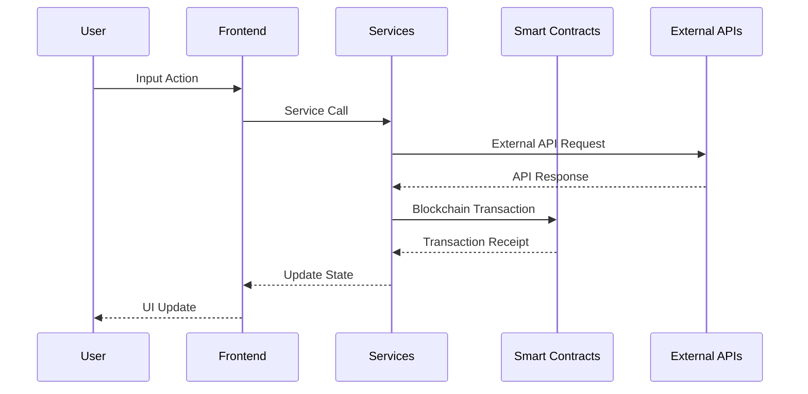
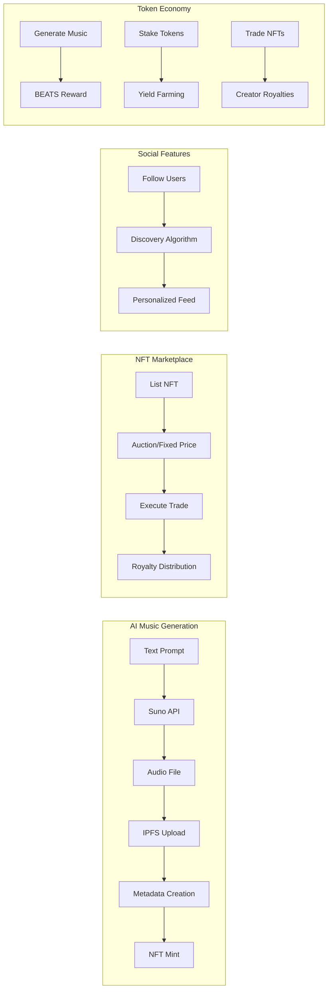

# HiBeats Architecture Diagram

## System Overview

```mermaid
graph TB
    %% User Layer
    subgraph "User Layer"
        WEB[Web Browser]
        MOBILE[Mobile Browser]
    end

    %% Frontend Layer
    subgraph "Frontend Layer"
        REACT[React 18 + TypeScript]
        VITE[Vite Build System]
        ROUTER[React Router]
        UI[Shadcn/UI Components]
        TAILWIND[TailwindCSS]
    end

    %% State Management
    subgraph "State Management"
        WAGMI[Wagmi Web3]
        TANSTACK[TanStack Query]
        SWR[SWR Cache]
        CONTEXTS[React Contexts]
    end

    %% Services Layer
    subgraph "Services Layer"
        SUNO_SVC[Suno AI Service]
        IPFS_SVC[IPFS/Pinata Service]
        WEB3_SVC[Web3 Service]
        EXPLORER_SVC[Explorer Service]
        NOTIF_SVC[Notification Service]
    end

    %% Smart Contracts
    subgraph "Smart Contracts (Somnia Testnet)"
        FACTORY[Factory Contract]
        NFT[NFT Contract]
        MARKET[Marketplace Contract]
        TOKEN[Token Contract]
        PROFILE[Profile Contract]
        ROYALTIES[Royalties Contract]
        PLAYLIST[Playlist Contract]
        STAKING[Staking Contract]
        DISCOVERY[Discovery Contract]
        ANALYTICS[Analytics Contract]
        INTERACTION[Interaction Contract]
        GOVERNANCE[Governance Contract]
    end

    %% External Services
    subgraph "External Services"
        SUNO_API[Suno AI API]
        PINATA[Pinata IPFS]
        WALLETCONNECT[WalletConnect]
        SHANNON[Shannon Explorer]
    end

    %% Authentication
    subgraph "Authentication"
        SIWE[SIWE Protocol]
        PINATA_AUTH[Pinata JWT]
    end

    %% Connections
    WEB --> REACT
    MOBILE --> REACT

    REACT --> ROUTER
    REACT --> UI
    REACT --> TAILWIND

    UI --> WAGMI
    UI --> TANSTACK
    UI --> SWR
    UI --> CONTEXTS

    WAGMI --> WEB3_SVC
    TANSTACK --> WEB3_SVC
    SWR --> WEB3_SVC

    WEB3_SVC --> FACTORY
    WEB3_SVC --> NFT
    WEB3_SVC --> MARKET
    WEB3_SVC --> TOKEN
    WEB3_SVC --> PROFILE
    WEB3_SVC --> ROYALTIES
    WEB3_SVC --> PLAYLIST
    WEB3_SVC --> STAKING
    WEB3_SVC --> DISCOVERY
    WEB3_SVC --> ANALYTICS
    WEB3_SVC --> INTERACTION
    WEB3_SVC --> GOVERNANCE

    SUNO_SVC --> SUNO_API
    IPFS_SVC --> PINATA
    WEB3_SVC --> WALLETCONNECT
    EXPLORER_SVC --> SHANNON

    REACT --> SIWE
    SIWE --> PINATA_AUTH

    %% Styling
    classDef user fill:#e3f2fd,stroke:#1976d2
    classDef frontend fill:#f3e5f5,stroke:#7b1fa2
    classDef state fill:#e8f5e8,stroke:#388e3c
    classDef services fill:#fff3e0,stroke:#f57c00
    classDef contracts fill:#fce4ec,stroke:#c2185b
    classDef external fill:#f3e5f5,stroke:#7b1fa2
    classDef auth fill:#e8f5e8,stroke:#388e3c

    class WEB,MOBILE user
    class REACT,VITE,ROUTER,UI,TAILWIND frontend
    class WAGMI,TANSTACK,SWR,CONTEXTS state
    class SUNO_SVC,IPFS_SVC,WEB3_SVC,EXPLORER_SVC,NOTIF_SVC services
    class FACTORY,NFT,MARKET,TOKEN,PROFILE,ROYALTIES,PLAYLIST,STAKING,DISCOVERY,ANALYTICS,INTERACTION,GOVERNANCE contracts
    class SUNO_API,PINATA,WALLETCONNECT,SHANNON external
    class SIWE,PINATA_AUTH auth
```



## Data Flow Architecture



## Component Architecture

```
src/
├── components/
│   ├── auth/           # Authentication UI
│   ├── generate/       # Music generation
│   ├── marketplace/    # NFT trading
│   ├── music/          # Audio components
│   ├── nft/           # NFT display
│   ├── pages/         # Page layouts
│   ├── player/        # Music player
│   ├── playlist/      # Playlist management
│   ├── profile/       # User profiles
│   ├── social/        # Social features
│   ├── staking/       # Staking UI
│   └── ui/            # Base components
├── hooks/             # Custom hooks
├── services/          # API integrations
├── contexts/          # Global state
├── config/            # Configuration
├── contracts/         # Smart contract ABIs
├── types/             # TypeScript types
└── utils/             # Helper functions
```

## Key Features Architecture

