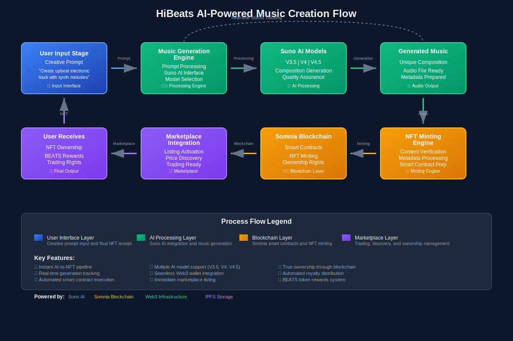

# HiBeats

## Project Demo
[Go to site](https://www.hibeats.fun/)

=======
  
  
  
  
## Project Demo
[Go to site](https://www.hibeats.xyz/)

>>>>>>> 504031320abd089212b2c521b6f3ba1b4fb43bb5

---
# Overview

## Introduction to HiBeats

Welcome to HiBeats, a revolutionary decentralized music creation and NFT marketplace seamlessly integrated with Suno AI music generation, blockchain technology, and the Somnia ecosystem. HiBeats is built to address one of the music industry's fundamental challenges: democratizing professional music creation while ensuring true ownership and fair monetization for creators. By leveraging cutting-edge AI technology and blockchain infrastructure, HiBeats allows users to generate professional-quality music from simple text prompts and instantly transform these creations into tradeable NFTs without the need for traditional music production tools, studios, or intermediaries.

At the core of HiBeats' music generation functionality is the Suno AI integration, which provides access to multiple AI models (V3.5, V4, V4.5) capable of creating professional compositions across various genres and styles. This architecture ensures high-quality output, supports diverse creative expressions, and unlocks unprecedented accessibility to music creation for creators of all backgrounds.

In parallel, the Somnia blockchain infrastructure delivers high-throughput, low-latency transactions with a comprehensive ecosystem of 12 deployed smart contracts covering everything from NFT minting to governance. This empowers HiBeats to maintain seamless user experiences, support real-time marketplace operations, and lay the foundation for advanced features such as automated royalty distribution, staking rewards, and community governance.

To make these capabilities more accessible, HiBeats integrates modern Web3 technologies including Wagmi, RainbowKit, and SIWE (Sign-In with Ethereum), which enable seamless wallet connectivity across web and mobile environments. Through this integration, users benefit from simplified wallet onboarding, persistent and secure dApp sessions, and automated transaction management that streamlines the music creation to NFT minting pipeline. Acting as a trusted gateway between users and HiBeats' smart contracts, the Web3 integration ensures that every music generation, minting, and trading operation is executed in a secure, intuitive, and user-friendly environment.

## What Is HiBeats?

HiBeats is a decentralized music creation and NFT marketplace designed to enable users to generate, mint, and trade AI-created music seamlessly across the blockchain. It introduces a novel approach to music production by removing the constraints of traditional music creation tools and enabling innovative AI-driven musical interactions.

The core mechanism behind HiBeats is powered by Suno AI integration, which facilitates professional music generation using advanced machine learning models. When a user inputs a creative prompt and wishes to generate music, the AI processes the request and creates unique compositions that can be immediately minted as NFTs, without relying on traditional recording studios or complex production workflows.

To support real-time generation tracking and NFT marketplace operations, HiBeats integrates with the Somnia blockchain ecosystem, which delivers high-performance transaction processing directly on-chain. This ensures that users always interact with up-to-date information when generating music, minting NFTs, or trading in the marketplace.

To further enhance accessibility and improve user experience across platforms, HiBeats also integrates modern Web3 infrastructure. This integration enables:
- Seamless wallet connectivity across devices
- Unified session management for persistent, secure dApp interactions
- Real-time generation status tracking and instant NFT minting workflows
- Social features for community building and music discovery

By using these technologies, HiBeats ensures that users can easily generate music, mint NFTs, trade compositions, and build their creator profiles all from a unified, intuitive interface on any device.

In addition to its music generation capabilities, HiBeats features a built-in reward system and staking mechanism, allowing users to earn BEATS tokens through active participation in music creation and community engagement. This functionality provides enhanced incentives for creators and collectors alike. To ensure accurate and up-to-date valuations during trading and staking operations, HiBeats leverages real-time marketplace data and automated smart contract systems. This integration helps preserve protocol integrity and ensures that all transactions are executed based on fair market values and community participation.

HiBeats combines these elements into a unified, modular architecture that prioritizes creativity, accessibility, true ownership, and community engagement, positioning it as a next-generation music platform for the evolving Web3 creator economy.

## Key Features

### AI-Powered Music Generation with Suno Integration

HiBeats facilitates professional music creation using Suno AI technology without the need for traditional music production skills or expensive equipment. Users are able to input creative prompts and generate unique compositions across multiple genres, enabling efficient creative expression and instant music production. This open-access model promotes musical inclusion while maintaining full creator ownership and control over generated works. Through the integration of modern Web3 infrastructure, users benefit from a seamless and secure wallet connection experience across platforms, allowing for persistent sessions and frictionless music generation workflows, simplifying user interaction with AI-powered music creation operations.

### Seamless NFT Minting and Marketplace Trading

HiBeats leverages blockchain technology to securely transform generated music into tradeable NFTs using smart contracts that ensure ownership authenticity, royalty distribution, and marketplace transparency through automated protocols that eliminate intermediaries and reduce transaction costs. This approach increases creator revenue and enables a composable music economy across the blockchain ecosystem. Enhancing this flow, the integration of advanced Web3 technologies automates wallet-blockchain interaction handling, allowing users to mint and trade NFTs seamlessly without manual transaction management, while maintaining an intuitive and consistent experience when executing marketplace operations.

### Real-Time Generation Tracking and Reward Systems

To support precise progress monitoring and informed creator decisions, HiBeats integrates real-time generation status updates and automated reward distribution systems, delivering instant feedback on music creation progress and BEATS token earnings to enable accurate tracking of creative output, enhance user transparency, and lay the groundwork for future implementations of advanced analytics and automated incentive mechanisms. Combined with the session persistence provided by modern Web3 infrastructure, HiBeats ensures that users can continuously monitor their generation progress and access up-to-date reward balances without the need to repeatedly reauthorize or reconnect their wallets, resulting in a seamless and reliable music creation experience.

### Native Social Features and Community Building

HiBeats includes native social features that allow users to build creator profiles, follow favorite artists, and discover new music within the platform without leaving the ecosystem, providing flexibility in community engagement and social interaction around music creation. To ensure accurate and engaging social experiences, this social mechanism integrates real-time activity feeds and community features that deliver up-to-date social interactions reflecting current platform activity. Enhanced by modern Web3 infrastructure, the social interaction process becomes a streamlined and user-friendly workflow, where profile updates, following, and community engagement are synchronized within a consistent interface—minimizing friction and delivering a smooth social music discovery experience.

## Join Us

HiBeats is a next-generation AI-powered music platform built with a focus on seamless user experience, accessibility, and creative empowerment. At the core of this experience is modern Web3 infrastructure, which empowers developers and users alike to interact with HiBeats' music generation and NFT features through persistent, secure wallet sessions and intuitive connection flows across platforms. By eliminating unnecessary friction in onboarding, music generation, and NFT minting, HiBeats makes AI-powered music creation feel as natural as traditional streaming.

We believe the future of music lies in democratization, true ownership, and collaborative creation. With Web3 infrastructure enabling effortless access and reliable blockchain connectivity, HiBeats provides a solid foundation for creators to build secure, user-friendly music applications and communities.

We invite musicians, developers, collectors, and curious minds to collaborate with us. Whether you're creating music on HiBeats, building integrations with our platform, or helping shape the future of AI-powered music creation, let's create a world where anyone can be a music creator and artists maintain full control over their work, no matter where they are.

---
# Problems and Solutions

In building a comprehensive AI-powered music creation and NFT marketplace, we identified the most pressing challenges in modern music production and designed focused solutions through integrations that prioritize accessibility, true ownership, and user empowerment, including with modern Web3 infrastructure.

## Barriers to Music Creation

**Problem**: Music creation is often constrained by expensive equipment, complex software, and technical skills, limiting access to professional music production for most aspiring creators.

**HiBeats' Solution**: HiBeats solves this through AI-powered music generation that enables anyone to create professional-quality compositions from simple text prompts, removing the need for traditional production tools, studios, or technical expertise. This unlocks creative potential for everyone and democratizes access to professional music creation. With the integration of modern Web3 infrastructure, users can interact with AI generation features through a seamless and persistent wallet connection, removing the friction of complex blockchain interactions while maintaining full ownership of their creations.

## Unfair Music Industry Monetization

**Problem**: Traditional music platforms often suffer from unfair revenue distribution, high platform fees, and lack of direct artist-fan connection, resulting in minimal compensation for creators and limited ownership rights.

**HiBeats' Solution**: By integrating blockchain-based NFT minting and direct peer-to-peer trading, HiBeats ensures creators maintain full ownership of their work and receive fair compensation through automated royalty systems and direct sales. Combined with Web3 infrastructure's session persistence, creators receive instant notifications and payments without needing to constantly manage complex blockchain transactions, maintaining a consistent and transparent view of their earnings and ownership rights.

## Limited Music Discovery and Community Engagement

**Problem**: Current music platforms operate within closed ecosystems, relying on algorithmic recommendations that limit music discovery and reduce genuine artist-fan connections, often prioritizing mainstream content over diverse creative expressions.

**HiBeats' Solution**: HiBeats is designed as a fully open, community-driven platform, enabling any user to discover, create, and share music without algorithmic limitations or centralized curation. This open-access architecture fosters authentic music discovery, enhances creative diversity, and aligns with the principles of decentralized content creation by supporting unrestricted global creative expression. Web3 infrastructure integration reinforces this open design by allowing any user to connect instantly from supported platforms, without requiring complex configurations or centralized access control.

## Inflexible Creator Monetization Options

**Problem**: Traditional music platforms require creators to rely solely on streaming revenue or limited merchandise sales, providing few options for monetizing their work and building sustainable creative careers.

**HiBeats' Solution**: HiBeats introduces multiple native monetization streams including NFT sales, royalty systems, staking rewards, and community tokens, allowing creators to diversify their income without relying solely on streaming metrics. This feature is backed by real-time blockchain infrastructure to ensure accurate tracking and instant payouts. The experience is further streamlined through Web3 infrastructure, which enables creators to manage multiple revenue streams, track earnings, and receive payments through a unified interface, reducing complexity and maintaining a smooth, responsive monetization workflow.

---

# Challenges

## Challenges Faced by HiBeats

### Seamless AI Integration Without Compromising Quality

**Challenge**: Implementing AI-powered music generation in a user-friendly platform often involves trade-offs between simplicity and creative control. HiBeats' challenge was to deliver professional-quality music generation while maintaining an intuitive user experience that doesn't overwhelm non-technical users. While building on top of Suno AI technology, HiBeats had to ensure not only the quality of generated compositions but also the seamless integration of AI prompting, generation tracking, and instant NFT minting workflows. This required careful handling of user input processing, generation status monitoring, and automated blockchain interactions throughout the system. Additionally, ensuring that users could interact with these complex AI operations intuitively led to the integration of modern Web3 infrastructure, which played a key role in abstracting away the technical overhead of blockchain interactions, allowing users to focus on their creative intent rather than the underlying technology.

### Real-Time Generation Tracking and Blockchain Integration

**Challenge**: Music generation using AI requires real-time status tracking and seamless blockchain integration for immediate NFT minting. HiBeats' integration of AI generation with blockchain technology introduces challenges related to transaction timing, gas fee optimization, and ensuring consistency during periods of high network activity. These systems must be integrated in a way that balances responsiveness with cost efficiency. Moreover, to ensure that users can monitor generation progress and execute minting operations without interruption, HiBeats relies on Web3 infrastructure to maintain persistent wallet sessions, enabling seamless access to generation status and immediate NFT minting capabilities, without forcing users to repeatedly reconnect or approve interactions during the creative process.

### Maintaining Platform Security Against Market Manipulation

**Challenge**: Operating a music NFT marketplace can expose the platform to price manipulation or artificial scarcity creation. Even when leveraging decentralized blockchain infrastructure, integrating real-time marketplace operations requires safeguards such as anti-manipulation measures, fair pricing mechanisms, and transparent transaction histories. HiBeats must ensure that marketplace operations, especially when used for critical functions like royalty distribution or creator rewards, do not become vectors for unfair practices. This challenge also extends to how users interact with sensitive marketplace processes. Through Web3 infrastructure, HiBeats enhances user-facing security by reducing signature fatigue and streamlining the UX around marketplace interactions, making trading and earning operations feel smoother and more transparent to end users.

### Scalable Music Generation Across User Demand

**Challenge**: Running an AI-powered music platform requires managing variable generation loads, API rate limits, and user experience consistency. HiBeats must account for peak usage periods, generation queue management, and maintaining consistent quality across different AI model versions. Managing processes like prompt processing, generation monitoring, and result delivery requires precise coordination and extensive optimization. Furthermore, maintaining a consistent user experience across different usage patterns is complex. By leveraging Web3 infrastructure, HiBeats ensures that users don't have to manually manage generation queues or troubleshoot connection issues during peak times. This abstraction enables the platform to focus on AI optimization while the infrastructure handles session management, status updates, and secure access, all contributing to a more unified and frictionless creative journey.

# How We Achieve AI-Powered Music Creation
<<<<<<< HEAD

=======

<svg viewBox="0 0 1200 800" xmlns="http://www.w3.org/2000/svg">
  <defs>
    <linearGradient id="userGradient" x1="0%" y1="0%" x2="100%" y2="100%">
      <stop offset="0%" style="stop-color:#3B82F6;stop-opacity:1" />
      <stop offset="100%" style="stop-color:#1E40AF;stop-opacity:1" />
    </linearGradient>
    <linearGradient id="aiGradient" x1="0%" y1="0%" x2="100%" y2="100%">
      <stop offset="0%" style="stop-color:#10B981;stop-opacity:1" />
      <stop offset="100%" style="stop-color:#059669;stop-opacity:1" />
    </linearGradient>
    <linearGradient id="blockchainGradient" x1="0%" y1="0%" x2="100%" y2="100%">
      <stop offset="0%" style="stop-color:#F59E0B;stop-opacity:1" />
      <stop offset="100%" style="stop-color:#D97706;stop-opacity:1" />
    </linearGradient>
    <linearGradient id="nftGradient" x1="0%" y1="0%" x2="100%" y2="100%">
      <stop offset="0%" style="stop-color:#8B5CF6;stop-opacity:1" />
      <stop offset="100%" style="stop-color:#7C3AED;stop-opacity:1" />
    </linearGradient>
  </defs>

  <!-- Background -->
  <rect width="1200" height="800" fill="#0F172A"/>

  <!-- Title -->
  <text x="600" y="40" text-anchor="middle" fill="#F1F5F9" font-family="Arial, sans-serif" font-size="24" font-weight="bold">HiBeats AI-Powered Music Creation Flow</text>

  <!-- Stage 1: User Input -->
  <rect x="50" y="100" width="200" height="120" rx="10" fill="url(#userGradient)" stroke="#60A5FA" stroke-width="2"/>
  <text x="150" y="130" text-anchor="middle" fill="white" font-family="Arial, sans-serif" font-size="14" font-weight="bold">User Input Stage</text>
  <text x="150" y="150" text-anchor="middle" fill="white" font-family="Arial, sans-serif" font-size="12">Creative Prompt</text>
  <text x="150" y="170" text-anchor="middle" fill="white" font-family="Arial, sans-serif" font-size="10">"Create upbeat electronic</text>
  <text x="150" y="185" text-anchor="middle" fill="white" font-family="Arial, sans-serif" font-size="10">track with synth melodies"</text>
  <text x="150" y="205" text-anchor="middle" fill="white" font-family="Arial, sans-serif" font-size="10">🎵 Input Interface</text>

  <!-- Arrow 1 -->
  <path d="M 260 160 L 320 160" stroke="#60A5FA" stroke-width="3" fill="none" marker-end="url(#arrowhead)"/>

  <!-- Stage 2: Music Generation Engine -->
  <rect x="330" y="100" width="200" height="120" rx="10" fill="url(#aiGradient)" stroke="#34D399" stroke-width="2"/>
  <text x="430" y="125" text-anchor="middle" fill="white" font-family="Arial, sans-serif" font-size="14" font-weight="bold">Music Generation</text>
  <text x="430" y="140" text-anchor="middle" fill="white" font-family="Arial, sans-serif" font-size="14" font-weight="bold">Engine</text>
  <text x="430" y="160" text-anchor="middle" fill="white" font-family="Arial, sans-serif" font-size="12">Prompt Processing</text>
  <text x="430" y="175" text-anchor="middle" fill="white" font-family="Arial, sans-serif" font-size="12">Suno AI Interface</text>
  <text x="430" y="190" text-anchor="middle" fill="white" font-family="Arial, sans-serif" font-size="12">Model Selection</text>
  <text x="430" y="205" text-anchor="middle" fill="white" font-family="Arial, sans-serif" font-size="10">⚙️ Processing Engine</text>

  <!-- Arrow 2 -->
  <path d="M 540 160 L 600 160" stroke="#34D399" stroke-width="3" fill="none" marker-end="url(#arrowhead)"/>

  <!-- Stage 3: Suno AI Models -->
  <rect x="610" y="100" width="200" height="120" rx="10" fill="url(#aiGradient)" stroke="#34D399" stroke-width="2"/>
  <text x="710" y="125" text-anchor="middle" fill="white" font-family="Arial, sans-serif" font-size="14" font-weight="bold">Suno AI Models</text>
  <text x="710" y="150" text-anchor="middle" fill="white" font-family="Arial, sans-serif" font-size="12">V3.5 | V4 | V4.5</text>
  <text x="710" y="170" text-anchor="middle" fill="white" font-family="Arial, sans-serif" font-size="12">Composition Generation</text>
  <text x="710" y="185" text-anchor="middle" fill="white" font-family="Arial, sans-serif" font-size="12">Quality Assurance</text>
  <text x="710" y="205" text-anchor="middle" fill="white" font-family="Arial, sans-serif" font-size="10">🤖 AI Processing</text>

  <!-- Arrow 3 -->
  <path d="M 820 160 L 880 160" stroke="#34D399" stroke-width="3" fill="none" marker-end="url(#arrowhead)"/>

  <!-- Stage 4: Generated Music -->
  <rect x="890" y="100" width="200" height="120" rx="10" fill="url(#aiGradient)" stroke="#34D399" stroke-width="2"/>
  <text x="990" y="125" text-anchor="middle" fill="white" font-family="Arial, sans-serif" font-size="14" font-weight="bold">Generated Music</text>
  <text x="990" y="150" text-anchor="middle" fill="white" font-family="Arial, sans-serif" font-size="12">Unique Composition</text>
  <text x="990" y="170" text-anchor="middle" fill="white" font-family="Arial, sans-serif" font-size="12">Audio File Ready</text>
  <text x="990" y="185" text-anchor="middle" fill="white" font-family="Arial, sans-serif" font-size="12">Metadata Prepared</text>
  <text x="990" y="205" text-anchor="middle" fill="white" font-family="Arial, sans-serif" font-size="10">🎼 Audio Output</text>

  <!-- Vertical Arrow Down -->
  <path d="M 990 230 L 990 290" stroke="#34D399" stroke-width="3" fill="none" marker-end="url(#arrowhead)"/>

  <!-- Stage 5: NFT Minting Engine -->
  <rect x="890" y="300" width="200" height="120" rx="10" fill="url(#blockchainGradient)" stroke="#FBBF24" stroke-width="2"/>
  <text x="990" y="325" text-anchor="middle" fill="white" font-family="Arial, sans-serif" font-size="14" font-weight="bold">NFT Minting</text>
  <text x="990" y="340" text-anchor="middle" fill="white" font-family="Arial, sans-serif" font-size="14" font-weight="bold">Engine</text>
  <text x="990" y="360" text-anchor="middle" fill="white" font-family="Arial, sans-serif" font-size="12">Content Verification</text>
  <text x="990" y="375" text-anchor="middle" fill="white" font-family="Arial, sans-serif" font-size="12">Metadata Processing</text>
  <text x="990" y="390" text-anchor="middle" fill="white" font-family="Arial, sans-serif" font-size="12">Smart Contract Prep</text>
  <text x="990" y="405" text-anchor="middle" fill="white" font-family="Arial, sans-serif" font-size="10">⚡ Minting Engine</text>

  <!-- Arrow Left -->
  <path d="M 880 360 L 820 360" stroke="#FBBF24" stroke-width="3" fill="none" marker-end="url(#arrowhead)"/>

  <!-- Stage 6: Somnia Blockchain -->
  <rect x="610" y="300" width="200" height="120" rx="10" fill="url(#blockchainGradient)" stroke="#FBBF24" stroke-width="2"/>
  <text x="710" y="325" text-anchor="middle" fill="white" font-family="Arial, sans-serif" font-size="14" font-weight="bold">Somnia Blockchain</text>
  <text x="710" y="350" text-anchor="middle" fill="white" font-family="Arial, sans-serif" font-size="12">Smart Contracts</text>
  <text x="710" y="370" text-anchor="middle" fill="white" font-family="Arial, sans-serif" font-size="12">NFT Minting</text>
  <text x="710" y="385" text-anchor="middle" fill="white" font-family="Arial, sans-serif" font-size="12">Ownership Rights</text>
  <text x="710" y="405" text-anchor="middle" fill="white" font-family="Arial, sans-serif" font-size="10">⛓️ Blockchain Layer</text>

  <!-- Arrow Left -->
  <path d="M 600 360 L 540 360" stroke="#FBBF24" stroke-width="3" fill="none" marker-end="url(#arrowhead)"/>

  <!-- Stage 7: Marketplace Integration -->
  <rect x="330" y="300" width="200" height="120" rx="10" fill="url(#nftGradient)" stroke="#A78BFA" stroke-width="2"/>
  <text x="430" y="325" text-anchor="middle" fill="white" font-family="Arial, sans-serif" font-size="14" font-weight="bold">Marketplace</text>
  <text x="430" y="340" text-anchor="middle" fill="white" font-family="Arial, sans-serif" font-size="14" font-weight="bold">Integration</text>
  <text x="430" y="360" text-anchor="middle" fill="white" font-family="Arial, sans-serif" font-size="12">Listing Activation</text>
  <text x="430" y="375" text-anchor="middle" fill="white" font-family="Arial, sans-serif" font-size="12">Price Discovery</text>
  <text x="430" y="390" text-anchor="middle" fill="white" font-family="Arial, sans-serif" font-size="12">Trading Ready</text>
  <text x="430" y="405" text-anchor="middle" fill="white" font-family="Arial, sans-serif" font-size="10">🏪 Marketplace</text>

  <!-- Arrow Left -->
  <path d="M 320 360 L 260 360" stroke="#A78BFA" stroke-width="3" fill="none" marker-end="url(#arrowhead)"/>

  <!-- Stage 8: Final Output -->
  <rect x="50" y="300" width="200" height="120" rx="10" fill="url(#nftGradient)" stroke="#A78BFA" stroke-width="2"/>
  <text x="150" y="325" text-anchor="middle" fill="white" font-family="Arial, sans-serif" font-size="14" font-weight="bold">User Receives</text>
  <text x="150" y="350" text-anchor="middle" fill="white" font-family="Arial, sans-serif" font-size="12">NFT Ownership</text>
  <text x="150" y="370" text-anchor="middle" fill="white" font-family="Arial, sans-serif" font-size="12">BEATS Rewards</text>
  <text x="150" y="385" text-anchor="middle" fill="white" font-family="Arial, sans-serif" font-size="12">Trading Rights</text>
  <text x="150" y="405" text-anchor="middle" fill="white" font-family="Arial, sans-serif" font-size="10">🎁 Final Output</text>

  <!-- Vertical Arrow Up (Connecting to User) -->
  <path d="M 150 290 L 150 230" stroke="#A78BFA" stroke-width="3" fill="none" marker-end="url(#arrowhead)"/>

  <!-- Real-time Tracking Arrows -->
  <path d="M 430 100 Q 430 50 710 50 Q 990 50 990 100" stroke="#64748B" stroke-width="2" fill="none" stroke-dasharray="5,5"/>
  <text x="600" y="45" text-anchor="middle" fill="#94A3B8" font-family="Arial, sans-serif" font-size="10">Real-time Status Tracking</text>

  <!-- Data Flow Labels -->
  <text x="290" y="140" text-anchor="middle" fill="#94A3B8" font-family="Arial, sans-serif" font-size="9">Prompt</text>
  <text x="570" y="140" text-anchor="middle" fill="#94A3B8" font-family="Arial, sans-serif" font-size="9">Processing</text>
  <text x="850" y="140" text-anchor="middle" fill="#94A3B8" font-family="Arial, sans-serif" font-size="9">Generation</text>
  <text x="990" y="270" text-anchor="middle" fill="#94A3B8" font-family="Arial, sans-serif" font-size="9">Audio</text>
  <text x="850" y="340" text-anchor="middle" fill="#94A3B8" font-family="Arial, sans-serif" font-size="9">Minting</text>
  <text x="570" y="340" text-anchor="middle" fill="#94A3B8" font-family="Arial, sans-serif" font-size="9">Blockchain</text>
  <text x="290" y="340" text-anchor="middle" fill="#94A3B8" font-family="Arial, sans-serif" font-size="9">Marketplace</text>
  <text x="150" y="270" text-anchor="middle" fill="#94A3B8" font-family="Arial, sans-serif" font-size="9">NFT</text>

  <!-- Legend -->
  <rect x="50" y="500" width="1100" height="180" rx="10" fill="#1E293B" stroke="#475569" stroke-width="1"/>
  <text x="600" y="525" text-anchor="middle" fill="#F1F5F9" font-family="Arial, sans-serif" font-size="16" font-weight="bold">Process Flow Legend</text>

  <!-- Legend Items -->
  <rect x="80" y="550" width="20" height="15" fill="url(#userGradient)"/>
  <text x="110" y="562" fill="#F1F5F9" font-family="Arial, sans-serif" font-size="12">User Interface Layer</text>
  <text x="110" y="575" fill="#94A3B8" font-family="Arial, sans-serif" font-size="10">Creative prompt input and final NFT receipt</text>

  <rect x="320" y="550" width="20" height="15" fill="url(#aiGradient)"/>
  <text x="350" y="562" fill="#F1F5F9" font-family="Arial, sans-serif" font-size="12">AI Processing Layer</text>
  <text x="350" y="575" fill="#94A3B8" font-family="Arial, sans-serif" font-size="10">Suno AI integration and music generation</text>

  <rect x="560" y="550" width="20" height="15" fill="url(#blockchainGradient)"/>
  <text x="590" y="562" fill="#F1F5F9" font-family="Arial, sans-serif" font-size="12">Blockchain Layer</text>
  <text x="590" y="575" fill="#94A3B8" font-family="Arial, sans-serif" font-size="10">Somnia smart contracts and NFT minting</text>

  <rect x="800" y="550" width="20" height="15" fill="url(#nftGradient)"/>
  <text x="830" y="562" fill="#F1F5F9" font-family="Arial, sans-serif" font-size="12">Marketplace Layer</text>
  <text x="830" y="575" fill="#94A3B8" font-family="Arial, sans-serif" font-size="10">Trading, discovery, and ownership management</text>

  <!-- Key Features -->
  <text x="80" y="610" fill="#F1F5F9" font-family="Arial, sans-serif" font-size="14" font-weight="bold">Key Features:</text>
  <text x="80" y="630" fill="#94A3B8" font-family="Arial, sans-serif" font-size="11">✓ Instant AI-to-NFT pipeline</text>
  <text x="80" y="645" fill="#94A3B8" font-family="Arial, sans-serif" font-size="11">✓ Real-time generation tracking</text>
  <text x="80" y="660" fill="#94A3B8" font-family="Arial, sans-serif" font-size="11">✓ Automated smart contract execution</text>

  <text x="350" y="630" fill="#94A3B8" font-family="Arial, sans-serif" font-size="11">✓ Multiple AI model support (V3.5, V4, V4.5)</text>
  <text x="350" y="645" fill="#94A3B8" font-family="Arial, sans-serif" font-size="11">✓ Seamless Web3 wallet integration</text>
  <text x="350" y="660" fill="#94A3B8" font-family="Arial, sans-serif" font-size="11">✓ Immediate marketplace listing</text>

  <text x="650" y="630" fill="#94A3B8" font-family="Arial, sans-serif" font-size="11">✓ True ownership through blockchain</text>
  <text x="650" y="645" fill="#94A3B8" font-family="Arial, sans-serif" font-size="11">✓ Automated royalty distribution</text>
  <text x="650" y="660" fill="#94A3B8" font-family="Arial, sans-serif" font-size="11">✓ BEATS token rewards system</text>

  <!-- Technology Stack -->
  <text x="80" y="700" fill="#F1F5F9" font-family="Arial, sans-serif" font-size="12" font-weight="bold">Powered by:</text>
  <text x="160" y="700" fill="#60A5FA" font-family="Arial, sans-serif" font-size="11">Suno AI</text>
  <text x="220" y="700" fill="#FBBF24" font-family="Arial, sans-serif" font-size="11">Somnia Blockchain</text>
  <text x="340" y="700" fill="#34D399" font-family="Arial, sans-serif" font-size="11">Web3 Infrastructure</text>
  <text x="480" y="700" fill="#A78BFA" font-family="Arial, sans-serif" font-size="11">IPFS Storage</text>

  <!-- Arrow marker definition -->
  <defs>
    <marker id="arrowhead" markerWidth="10" markerHeight="7" refX="10" refY="3.5" orient="auto">
      <polygon points="0 0, 10 3.5, 0 7" fill="#64748B"/>
    </marker>
  </defs>
</svg>
>>>>>>> 504031320abd089212b2c521b6f3ba1b4fb43bb5

HiBeats achieves professional music generation by leveraging Suno AI technology to facilitate creation and immediate NFT minting. The platform enables users to input creative prompts and generate unique compositions that can be instantly transformed into tradeable NFTs without relying on traditional music production tools or complex blockchain interactions through an intuitive AI-to-blockchain pipeline.

In our current architecture, as illustrated:

- On the **Frontend Interface**, users input creative prompts (e.g., "Create an upbeat electronic track with synthesizer melodies") into the HiBeats generation interface. The prompt is processed by our `MusicGenerationEngine`, which interfaces with Suno AI APIs. This engine handles prompt optimization, model selection (V3.5, V4, V4.5), and generation parameters, then initiates the AI music creation process with real-time status tracking.

- The AI generation process utilizes Suno's advanced machine learning models to create unique compositions based on user prompts. Multiple AI models ensure diverse output styles and high-quality results. The generation status is tracked in real-time and transmitted through our notification system, providing users with instant feedback on creation progress.

- Once the music generation is complete on the **AI Processing Layer**, the resulting audio file is automatically processed by our `NFTMintingEngine`. This engine verifies the generated content, prepares metadata, and interfaces with our Somnia blockchain smart contracts to mint the music as an NFT, crediting the user with full ownership rights and enabling immediate marketplace listing or trading.

- Both generated music metadata and marketplace pricing are continuously updated using real-time blockchain data and our integrated reward systems. These feeds are crucial for determining creator earnings, tracking generation statistics, and enabling dynamic marketplace operations within the platform.

By combining Suno AI technology with Somnia blockchain infrastructure, HiBeats unlocks native AI-to-NFT music creation with high levels of quality, accessibility, and true ownership without relying on traditional production tools or complex technical workflows. This positions HiBeats as a pioneering, user-friendly platform ready to democratize music creation across the global creative community.

---

## Marketplace
<<<<<<< HEAD

HiBeats incorporates a purpose-built NFT marketplace that enables users to trade, discover, and collect AI-generated music directly within the platform without needing external marketplaces. Inspired by modern marketplace architectures, the system is tightly integrated into the HiBeats ecosystem to facilitate real-time, on-chain music NFT trading with minimal friction.

## 1. Creator Revenue and NFT Structure
Music creators automatically receive NFT ownership upon generation completion, with smart contracts handling immediate minting and metadata storage. Generated music NFTs include embedded royalty structures, ensuring creators receive ongoing compensation from secondary sales. The HiBeats marketplace maintains transparent pricing and ownership records for all music NFTs.

The platform continuously tracks creator earnings and provides real-time analytics on NFT performance and market activity.

=======

HiBeats incorporates a purpose-built NFT marketplace that enables users to trade, discover, and collect AI-generated music directly within the platform without needing external marketplaces. Inspired by modern marketplace architectures, the system is tightly integrated into the HiBeats ecosystem to facilitate real-time, on-chain music NFT trading with minimal friction.

## 1. Creator Revenue and NFT Structure
Music creators automatically receive NFT ownership upon generation completion, with smart contracts handling immediate minting and metadata storage. Generated music NFTs include embedded royalty structures, ensuring creators receive ongoing compensation from secondary sales. The HiBeats marketplace maintains transparent pricing and ownership records for all music NFTs.

The platform continuously tracks creator earnings and provides real-time analytics on NFT performance and market activity.

>>>>>>> 504031320abd089212b2c521b6f3ba1b4fb43bb5
## 2. Trading Execution
All users can access the marketplace functionality for discovering and purchasing music NFTs. The marketplace supports both fixed-price sales and auction-style listings, enabling flexible pricing strategies for creators and fair price discovery for collectors.

When a user initiates a purchase, the marketplace logic references current market activity and applies secure smart contract execution to ensure safe, instant ownership transfer. The system also integrates with real-time blockchain data to ensure accurate pricing and prevent fraudulent transactions.

## 3. Blockchain Integration for Ownership Verification
To maintain secure ownership tracking and transfer verification, HiBeats utilizes Somnia blockchain infrastructure. This provides tamper-proof, instant transaction settlement for all music NFT trades, ensuring that each purchase maintains clear ownership history and authentic creator attribution. This is critical for maintaining trust in the marketplace and protecting both creator and collector rights.

## 4. Creator Incentivization through Royalties
Each marketplace transaction includes automated royalty distribution to original creators based on their smart contract terms. This royalty structure incentivizes continued music creation and supports the long-term sustainability of the creator economy on HiBeats.

---

## HiBeats Smart Contract Architecture

HiBeats leverages a comprehensive smart contract ecosystem on the Somnia blockchain to enable secure, transparent, and automated music creation and trading. The platform's smart contracts form the foundation of HiBeats' decentralized architecture, covering everything from NFT minting to governance.

### 1. Core Music and NFT Contracts
To support native music NFT creation and ownership management, HiBeats integrates multiple specialized smart contracts that handle music generation tracking, NFT minting, and ownership verification.

When a user completes music generation and initiates NFT minting, the HiBeatsNFT contract executes automated minting with embedded metadata and royalty structures. The contract ensures cryptographically verifiable ownership and maintains immutable creation records. Upon successful minting, the marketplace contracts enable immediate trading and price discovery without reliance on external platforms.

### 2. Token Economy and Rewards System
In addition to NFT functionality, HiBeats uses the BEATS token ecosystem to power platform incentives and community participation. The token contracts provide automated reward distribution for music generation, listening activity, and community engagement.

This integration enables HiBeats to:
- Reward creators with 10 BEATS per music generation
- Distribute listening rewards at 0.001 BEATS per minute
- Support staking mechanisms for additional yield
- Enable governance participation through token ownership
- Maintain transparent and automated reward calculations

By combining comprehensive smart contract coverage with user-friendly interfaces, HiBeats achieves a robust and composable infrastructure for decentralized music creation and trading. The synergy of these technologies ensures users enjoy a seamless, secure, and rewarding music creation experience without sacrificing decentralization, transparency, or creative control.

---

# HiBeats Smart Contract Ecosystem
## Deployed Contracts on Somnia

- **HiBeatsToken (BEATS)**
  - **Address**: `0x665641f2b9614027b4fF55E1d562aD3f97F26784`
  - **Function**: Platform utility token for rewards and governance
  - **Features**: Automated reward distribution, staking support

- **HiBeatsNFT**
  - **Address**: `0x429294B8e46b07AdE397A0478baEA87F168F9E32`
  - **Function**: Music NFT minting and ownership management
  - **Features**: Embedded royalties, metadata storage

- **Marketplace**
  - **Address**: `0xC4d82fe72A690b0DDC0e53C91Efa9fa4485d1D60`
  - **Function**: NFT trading and price discovery
  - **Features**: Fixed price sales, auction support

- **Factory**
  - **Address**: `0xbC79e69d0993AFAF74657e9578425339fF94c9CD`
  - **Function**: Contract deployment and management
  - **Features**: Automated contract creation

- **Profile Management**
  - **Address**: `0x1259D20501c2574C36d7A80c45B9bD4CbE152c6B`
  - **Function**: Creator profile and social features
  - **Features**: Portfolio tracking, social connections

- **Royalty Distribution**
  - **Address**: `0xa110b05952c4E504285d38Bd38cA8b6F0F8c0cE8`
  - **Function**: Automated creator compensation
  - **Features**: Secondary sale royalties, instant payouts

- **Playlist Management**
  - **Address**: `0x7bbd3dfe64164b11aa11DFD209A4F16B797e14d4`
  - **Function**: Community playlist creation
  - **Features**: Collaborative playlists, discovery

- **Staking System**
  - **Address**: `0x4d6e22739B70531338e0e79e4938E927a200779B`
  - **Function**: BEATS token staking and yield generation
  - **Features**: Flexible staking periods, reward multipliers

- **Discovery Engine**
  - **Address**: `0xC648F2f6F8C1F1D6F5aDF3A03c934d0f7013C693`
  - **Function**: Music recommendation and search
  - **Features**: Genre filtering, trend tracking

- **Analytics Tracking**
  - **Address**: `0x61272668C7dF68F9c6B60C6d0edd9cB650e9fd88`
  - **Function**: Platform metrics and creator analytics
  - **Features**: Real-time statistics, performance tracking

- **Social Interactions**
  - **Address**: `0xA96A4b990C400666bEf50aCE2348382D664cE7de`
  - **Function**: Community engagement features
  - **Features**: Following, likes, comments

- **Governance System**
  - **Address**: `0xD571586eba34033FB1134DF6BB982cB61625e174`
  - **Function**: Community governance and voting
  - **Features**: Proposal creation, token-weighted voting

## Platform Features

- **AI Music Generation**: Professional music creation using Suno AI (V3.5, V4, V4.5)
- **Instant NFT Minting**: Seamless conversion from generated music to tradeable NFTs
- **Dual Token Economy**: STT and BEATS token support for comprehensive platform economics
- **Creator Rewards**: Automated compensation for generation, listening, and community participation
- **Social Discovery**: Community-driven music exploration and creator networking

## Integration with HiBeats

These smart contracts power HiBeats' comprehensive music creation and trading ecosystem on the Somnia blockchain. Real-time blockchain integration ensures accurate reward distribution, transparent ownership tracking, and seamless user experiences, enabling a secure and efficient decentralized music platform.

## 🔗 Links

<<<<<<< HEAD
- 🌐 Website: [https://www.hibeats.fun/](https://www.hibeats.fun/)
- 🏢 Organization: [https://github.com/yourusername/hibeats-github](https://github.com/yourusername/hibeats-github)
- 📑 Documentation: [Comprehensive Documentation](./HIBEATS_COMPREHENSIVE_DOCUMENTATION.md)
- 🎥 Demo Video: [Platform Walkthrough](#)
=======
- 🌐 Website: [https://www.hibeats.xyz/](https://www.hibeats.xyz/)
- 🏢 Organization: [https://github.com/NGDK101/Hibeats--Somnia-Defi-Mini-Hackathon](https://github.com/NGDK101/Hibeats--Somnia-Defi-Mini-Hackathon)
- 📑 Documentation: [Comprehensive Documentation]()
- 🎥 Demo Video: [Platform Walkthrough](https://drive.google.com/drive/folders/1GRXqQw2aVn-GUDIRMctkXrcnAAhMlRvB)
>>>>>>> 504031320abd089212b2c521b6f3ba1b4fb43bb5

---

## License

MIT License © 2025 HiBeats

<<<<<<< HEAD
---
=======
---
>>>>>>> 504031320abd089212b2c521b6f3ba1b4fb43bb5
