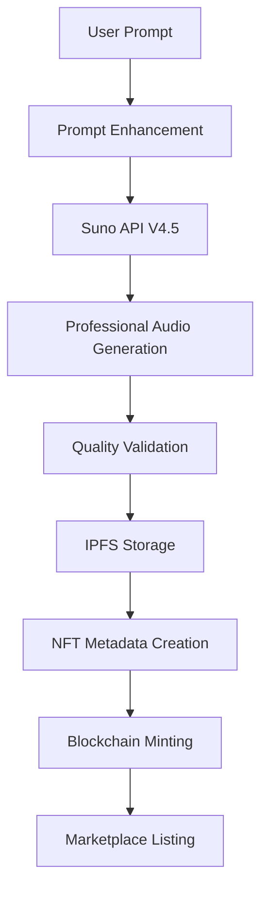

# 🎯 HiBeats - Hackathon Study Case

## 📋 Executive Summary

**HiBeats** adalah solusi revolusioner untuk mengatasi krisis monetisasi dalam industri musik melalui integrasi **AI music generation** dan **blockchain technology**. Platform ini mendemokratisasi pembuatan musik profesional dan memberikan ownership sejati kepada creators melalui NFT ecosystem.

---

## 🎯 Problem Statement

### 📊 The Music Industry Crisis

#### **Problem 1: Creator Monetization Crisis**
```
Current Reality:
├── 78% independent artists earn <$1,000/year from music
├── Spotify pays $0.003-$0.005 per stream
├── Artists need 1M+ streams for $3,000-$5,000
└── Traditional labels take 70-90% of revenue
```

**Impact**: Talented artists abandon music careers due to financial unsustainability.

#### **Problem 2: High Barriers to Music Production**
```
Traditional Music Creation:
├── Studio Recording: $500-$5,000 per track
├── Equipment Investment: $10,000+ for professional setup
├── Technical Skills: Years of training required
└── Time Investment: Weeks to months per track
```

**Impact**: Only privileged individuals can afford professional music production.

#### **Problem 3: Lack of True Digital Ownership**
```
Current Digital Music:
├── Streaming: Rent-based model, no ownership
├── Downloads: DRM-protected, limited rights
├── No Resale Value: Cannot transfer or sell
└── Platform Dependency: Music disappears if platform shuts down
```

**Impact**: Fans and collectors have no real ownership in digital age.

#### **Problem 4: Unfair Revenue Distribution**
```
Typical Revenue Split:
├── Record Label: 50-70%
├── Distributor: 10-15%
├── Platform: 15-30%
├── Producer/Writer: 5-10%
└── Artist: 5-15%
```

**Impact**: Creators receive minimal compensation despite being content creators.

#### **Problem 5: Discovery Algorithm Bias**
```
Platform Algorithm Reality:
├── 90% of streams go to top 10% of artists
├── Pay-to-play promotion models
├── Algorithmic bias toward established artists
└── Limited organic discovery for new talents
```

**Impact**: Independent artists struggle to reach audiences despite quality content.

---

## 💡 Solution Overview

### 🚀 HiBeats Revolutionary Approach

#### **Solution Architecture**
```
Traditional Process:
Idea → Studio → Recording → Mixing → Mastering → Distribution → Discovery
Time: Months | Cost: $1000s | Success Rate: <5%

HiBeats Innovation:
Idea → AI Generation → NFT Minting → Marketplace → Community Discovery
Time: Minutes | Cost: <$1 | Success Rate: 100% production
```

### 🎯 Core Solutions

#### **1. AI-Democratized Music Creation**
```typescript
// From Concept to Professional Track in Minutes
const createMusic = async (prompt: string) => {
  const professional_track = await sunoAI.generate({
    prompt: prompt,
    quality: "professional",
    duration: "full_song",
    style: "auto_enhanced"
  });

  return instant_professional_music;
};
```

**Benefits**:
- **Cost Reduction**: 99.9% reduction in production costs
- **Time Efficiency**: Minutes instead of months
- **Quality Assurance**: Professional-grade output guaranteed
- **Accessibility**: No technical skills required

#### **2. True Digital Ownership via NFTs**
```solidity
contract HiBeatsNFT {
    // Immutable ownership certificates
    function mint(string memory musicURI, address creator)
        returns (uint256 tokenId) {
        // Creates permanent, transferable ownership
        // Enables resale and collection value
        // Guarantees authenticity and provenance
    }
}
```

**Benefits**:
- **Permanent Ownership**: Blockchain-verified certificates
- **Transferability**: Can sell, trade, or gift music
- **Provenance**: Immutable creation and ownership history
- **Investment Value**: Potential appreciation over time

#### **3. Fair Creator Economy**
```
HiBeats Revenue Distribution:
├── Creator: 90-95% (vs 5-15% traditional)
├── Platform: 2.5-5%
├── Network Fees: 2.5-5%
└── Automatic Royalties: Ongoing passive income
```

**Benefits**:
- **10x Revenue Increase**: From hundreds to thousands per year
- **Direct Monetization**: No intermediaries taking large cuts
- **Passive Income**: Royalties on every resale
- **Global Reach**: Access to worldwide audience

#### **4. Community-Driven Discovery**
```typescript
const discoveryAlgorithm = {
  metrics: {
    community_engagement: 40%,
    creator_reputation: 30%,
    listening_metrics: 20%,
    trending_signals: 10%
  },
  bias: "pro_independent_creators"
};
```

**Benefits**:
- **Algorithmic Fairness**: Equal opportunity for all creators
- **Community Curation**: Fan-driven discovery
- **Creator Support**: Built-in promotion for new artists
- **Engagement Rewards**: Fans earn tokens for discovery

---

## 🔬 Technical Innovation

### **AI Music Generation Pipeline**

#### **Suno AI Integration**


**Innovation Points**:
- **Multi-Model Support**: V3.5, V4, V4.5 for different quality levels
- **Style Control**: 100+ genre templates with custom prompting
- **Quality Assurance**: Automatic enhancement and validation
- **Instant Availability**: From idea to market in <5 minutes

### **Smart Contract Ecosystem**

#### **Comprehensive Architecture**
```
┌─────────────────────────────────────────────────────────────┐
│                HiBeats Smart Contract Ecosystem             │
├─────────────────────────────────────────────────────────────┤
│                                                            │
│  ┌─────────────┐    ┌──────────────┐    ┌─────────────┐   │
│  │   Factory   │◄──►│     NFT      │◄──►│ Marketplace │   │
│  │   (Core)    │    │  (ERC-721)   │    │  (Trading)  │   │
│  └─────────────┘    └──────────────┘    └─────────────┘   │
│         ▲                   ▲                    ▲        │
│  ┌─────────────┐    ┌──────────────┐    ┌─────────────┐   │
│  │   Token     │◄──►│   Profile    │◄──►│  Royalties  │   │
│  │ (ERC-20)    │    │  (Identity)  │    │ (Revenue)   │   │
│  └─────────────┘    └──────────────┘    └─────────────┘   │
│         ▲                   ▲                    ▲        │
│  ┌─────────────┐    ┌──────────────┐    ┌─────────────┐   │
│  │  Staking    │◄──►│  Discovery   │◄──►│ Governance  │   │
│  │   (Yield)   │    │ (Algorithm)  │    │   (DAO)     │   │
│  └─────────────┘    └──────────────┘    └─────────────┘   │
│                                                            │
└─────────────────────────────────────────────────────────────┘
```

**Innovation**: First comprehensive music NFT ecosystem with integrated AI generation.

### **Economic Innovation**

#### **Dual Token Economy**
```typescript
interface TokenEconomy {
  STT: {
    purpose: "Network gas and high-value transactions",
    utility: "Cross-chain compatibility",
    scarcity: "Network native token"
  },

  BEATS: {
    purpose: "Platform utility and rewards",
    utility: "Governance, features, staking",
    distribution: "Activity-based earning"
  }
}
```

**Innovation**: Seamless dual-token system optimizing for both network efficiency and user rewards.

---

## 📊 Market Opportunity

### **Total Addressable Market (TAM)**

#### **Market Size Analysis**
```
Global Music Industry: $26.2B (2023)
├── Digital Streaming: $17.5B (67%)
├── Physical Sales: $5.1B (19%)
├── Performance Rights: $2.8B (11%)
└── Synchronization: $0.8B (3%)

Independent Artist Segment: $8.2B
├── Currently Undermonetized: 78% earn <$1000/year
├── HiBeats Target: 5% early adopters = 25M artists
├── Revenue Potential: $50-500/year = $1.25B-12.5B market
```

#### **NFT Music Market**
```
Current NFT Music Market: $393M (2023)
├── Growth Rate: 45% YoY
├── Market Share: 2.5% of total NFT market
├── Projected 2027: $2.1B

HiBeats Addressable:
├── Music Creators: 500M globally
├── Early Adopters: 5-10% = 25-50M users
├── Average Spending: $100-500/year
├── Market Potential: $2.5B-25B
```

### **Competitive Landscape**

#### **Current Players Analysis**
| Platform | Focus | Market Share | Revenue Model | Weakness |
|----------|--------|--------------|---------------|----------|
| **Spotify** | Streaming | 31% global | Subscription + Ads | Poor creator pay |
| **Apple Music** | Streaming | 15% global | Subscription | Closed ecosystem |
| **Sound.xyz** | Music NFTs | <0.1% | Transaction fees | Limited scale |
| **Royal** | Music Investment | <0.1% | Investment returns | High barriers |
| **Audius** | Decentralized | <0.1% | Token rewards | UX complexity |

#### **HiBeats Competitive Advantage**
```
Unique Value Proposition:
├── AI + Blockchain Integration: First-to-market
├── Complete Ecosystem: End-to-end solution
├── Creator Economics: 10x better revenue sharing
├── User Experience: Web2 simplicity with Web3 benefits
└── Technology Innovation: Advanced smart contracts + AI
```

---

## 🎯 Business Model & Economics

### **Revenue Streams**

#### **1. Transaction-Based Revenue**
```
Marketplace Fees:
├── NFT Sales: 2.5% per transaction
├── Auction Settlements: 2.5% of final bid
├── Monthly Volume Target: $100K-1M
├── Expected Revenue: $2.5K-25K/month
```

#### **2. Premium Services**
```
AI Generation Services:
├── Basic: 3 free generations/day
├── Premium: Unlimited for $15/month
├── Advanced Features: $5-20 per generation
├── Target Users: 10% conversion rate
├── Expected Revenue: $10K-100K/month
```

#### **3. Token Economy**
```
BEATS Token Utility:
├── Platform Governance: Voting rights
├── Staking Rewards: 12-18% APY
├── Premium Access: Discounted fees
├── Creator Tools: Advanced features
├── Expected Revenue: $5K-50K/month
```

### **Unit Economics**

#### **Customer Acquisition**
```
Creator Acquisition:
├── Cost per Acquisition: $10-25
├── Average Revenue per User: $50-200/year
├── Customer Lifetime Value: $250-1000
├── Payback Period: 2-6 months
├── LTV/CAC Ratio: 10-40x
```

#### **Financial Projections**
```
Year 1 Targets:
├── Month 3: 1,000 users, $5K revenue
├── Month 6: 5,000 users, $25K revenue
├── Month 12: 25,000 users, $150K revenue
├── Break-even: Month 8-10
├── Profitability: Month 12+
```

---

## 🚀 Implementation Strategy

### **Go-to-Market Strategy**

#### **Phase 1: Creator Acquisition (Months 1-3)**
```
Target: Independent artists and content creators
Strategy:
├── Direct outreach to musician communities
├── Showcase AI generation capabilities
├── Offer free premium features for early adopters
├── Build case studies and success stories
```

#### **Phase 2: Community Building (Months 3-6)**
```
Target: Music collectors and fans
Strategy:
├── Launch exclusive NFT drops
├── Implement social features and discovery
├── Partner with influencers and tastemakers
├── Create viral marketing campaigns
```

#### **Phase 3: Ecosystem Expansion (Months 6-12)**
```
Target: Mainstream adoption
Strategy:
├── Mobile app launch
├── Integration with existing platforms
├── Enterprise partnerships
├── Global market expansion
```

### **Technical Roadmap**

#### **Q1 2024: Foundation** ✅
- ✅ Smart contract deployment on Somnia
- ✅ Suno AI integration and testing
- ✅ MVP frontend development
- ✅ Basic marketplace functionality

#### **Q2 2024: Enhancement** 🔄
- 🔄 Mobile application development
- 🔄 Advanced social features
- 🔄 Performance optimization
- 🔄 Multi-language support

#### **Q3 2024: Scale** 📅
- 📅 Cross-chain bridge implementation
- 📅 Third-party integrations
- 📅 Enterprise API launch
- 📅 Advanced AI features

#### **Q4 2024: Leadership** 📅
- 📅 Global expansion
- 📅 Institutional partnerships
- 📅 Advanced analytics
- 📅 Ecosystem maturity

---

## 📈 Success Metrics & KPIs

### **Key Performance Indicators**

#### **User Metrics**
```
Growth Metrics:
├── Monthly Active Users (MAU)
├── Creator Registration Rate
├── User Retention (D1, D7, D30)
├── Session Duration and Frequency
└── Geographic Distribution
```

#### **Economic Metrics**
```
Revenue Metrics:
├── Monthly Recurring Revenue (MRR)
├── Average Revenue Per User (ARPU)
├── Customer Lifetime Value (CLV)
├── Gross Margin per Transaction
└── Token Economy Health
```

#### **Platform Metrics**
```
Activity Metrics:
├── Music Generations per Day
├── NFT Mint Rate
├── Marketplace Transaction Volume
├── Social Engagement Rate
└── Creator Success Rate
```

### **Success Benchmarks**

#### **Year 1 Targets**
| Metric | Q1 | Q2 | Q3 | Q4 |
|--------|----|----|----|----|
| **Active Users** | 1K | 5K | 15K | 25K |
| **Monthly Revenue** | $5K | $25K | $75K | $150K |
| **NFTs Created** | 500 | 5K | 25K | 75K |
| **Creator Earnings** | $2K | $15K | $50K | $120K |

#### **Long-term Vision (3-5 years)**
```
Market Leadership Goals:
├── 1M+ active creators globally
├── $100M+ annual marketplace volume
├── Leading AI music platform
├── Industry standard for music NFTs
└── Sustainable creator economy
```

---

## ⚠️ Risk Assessment & Mitigation

### **Technical Risks**

#### **AI Dependency Risk**
- **Risk**: Suno API limitations or changes
- **Probability**: Medium
- **Impact**: High
- **Mitigation**: Multiple AI provider integration, local model development

#### **Smart Contract Security**
- **Risk**: Vulnerabilities in contracts
- **Probability**: Low
- **Impact**: High
- **Mitigation**: Multiple audits, formal verification, bug bounties

#### **Scalability Challenges**
- **Risk**: Network congestion affecting UX
- **Probability**: Medium
- **Impact**: Medium
- **Mitigation**: Layer 2 solutions, optimized contracts

### **Market Risks**

#### **Regulatory Changes**
- **Risk**: Unfavorable crypto regulations
- **Probability**: Medium
- **Impact**: High
- **Mitigation**: Multi-jurisdiction strategy, legal compliance

#### **Competition**
- **Risk**: Major players entering space
- **Probability**: High
- **Impact**: Medium
- **Mitigation**: First-mover advantage, continuous innovation

#### **Adoption Resistance**
- **Risk**: Slow Web3 adoption by musicians
- **Probability**: Medium
- **Impact**: Medium
- **Mitigation**: Superior UX, education, clear value proposition

### **Mitigation Framework**

#### **Risk Monitoring**
- **Real-time**: System health and security monitoring
- **Weekly**: Market analysis and competitive intelligence
- **Monthly**: User feedback and adoption metrics
- **Quarterly**: Strategic review and pivot assessment

---

## 🏆 Conclusion & Call to Action

### **The Opportunity**

HiBeats represents a **$10+ billion market opportunity** to revolutionize how music is created, owned, and monetized. By combining AI democratization with blockchain ownership, we solve fundamental industry problems while creating new economic opportunities.

### **Why Now?**

```
Perfect Storm of Conditions:
├── AI Music Quality: Reached professional standards
├── Web3 Infrastructure: Mature and user-friendly
├── Creator Economy: $104B market seeking better tools
├── Digital Ownership: Growing demand for NFT utility
└── Market Timing: Early but proven technology adoption
```

### **The Vision**

**HiBeats will become the primary platform where the next generation of musicians build their careers**, where fans truly own the music they love, and where the creative economy is fair, transparent, and sustainable.

### **Impact Potential**

#### **For Creators**
- **Income Transformation**: From $1K/year to $10K+ potential
- **Creative Freedom**: No gatekeepers or label dependencies
- **Global Reach**: Direct access to worldwide audiences

#### **For Collectors**
- **True Ownership**: Permanent, transferable digital assets
- **Investment Opportunity**: Early access to emerging artists
- **Community Building**: Direct creator-fan relationships

#### **For Industry**
- **Democratization**: Level playing field for all creators
- **Innovation**: New business models and revenue streams
- **Sustainability**: Fair compensation for artistic work

### **The Ask**

We invite investors, partners, and the community to join us in building the future of music. HiBeats is not just a platform – it's a movement toward a more equitable, creative, and sustainable music industry.

**Together, we can revolutionize how the world creates, owns, and experiences music.**

---

## 📞 Contact & Next Steps

### **Team**
**Bayu Mukti Wibowo** - Founder & Lead Developer
- Full-stack Web3 developer
- AI and blockchain integration specialist
- Passionate about democratizing music creation

### **Resources**
- **Live Platform**: [HiBeats.fun](https://hibeats.fun)
- **GitHub Repository**: Open source components
- **Documentation**: Complete technical specifications
- **Demo Video**: Full feature walkthrough

### **Partnership Opportunities**
- **Investors**: Seed funding for growth acceleration
- **AI Partners**: Enhanced generation capabilities
- **Music Industry**: Integration and adoption
- **Technology**: Infrastructure and tooling

---

*This study case demonstrates HiBeats as a comprehensive solution to music industry challenges through innovative technology integration and sustainable economic models.*

**Prepared for**: Hackathon Presentation
**Date**: September 27, 2024
**Version**: 1.0
**Author**: Bayu Mukti Wibowo