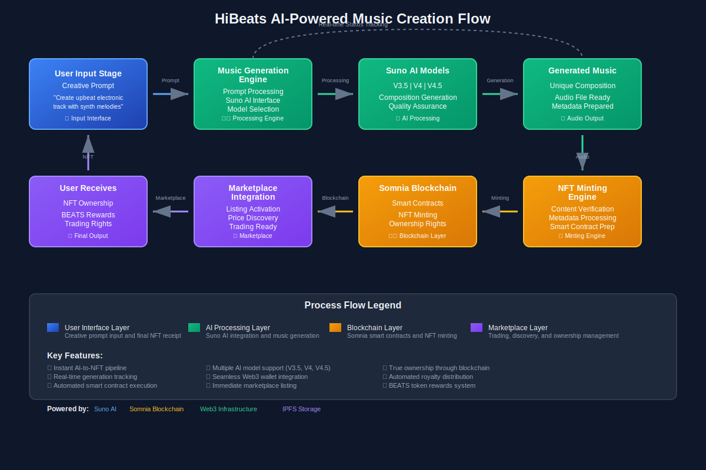

# HiBeats - AI-Powered Music NFT Platform

🎯 **What We Built**

HiBeats is a comprehensive Web3 music platform that revolutionizes how music is created, owned, and monetized. Built on Somnia blockchain, our platform integrates Suno AI for music generation with a complete NFT marketplace ecosystem, addressing the fundamental challenge of democratizing professional music creation while ensuring true ownership and fair monetization for creators.

---

## ✨ Key Features

### 🤖 AI Music Generation
- **Suno AI Integration**: Generate professional music from text descriptions using multiple AI models (V3.5, V4, V4.5)
- **Advanced Controls**: Custom styles, instrumental mode, vocal gender selection, and genre customization
- **Daily Limits**: Fair usage with 3 generations per user per day to ensure quality and sustainability
- **Instant NFT Minting**: Generated tracks automatically become tradeable NFTs through seamless blockchain integration
- **Real-time Tracking**: Live generation status updates and progress monitoring

### 🏪 Advanced NFT Marketplace
- **Dual Currency Support**: Trade using STT (Somnia native tokens) or BEATS utility tokens
- **Flexible Trading**: Both auction systems with time-based bidding and fixed-price instant sales
- **Automated Royalties**: Built-in 0-10% creator royalty distribution on secondary sales
- **Advanced Discovery**: Genre-based browsing, advanced search, and intelligent recommendation engine
- **Social Integration**: Community-driven marketplace with social features and creator profiles

### 💰 Comprehensive Token Economy
- **BEATS Token**: ERC-20 utility token powering platform rewards and governance
- **Generation Rewards**: Earn 10 BEATS per successful AI music generation
- **Listening Rewards**: Earn 0.001 BEATS per minute of music streaming and engagement
- **Staking System**: Stake BEATS tokens for additional yield and platform benefits
- **Creator Monetization**: Multiple revenue streams including direct sales, royalties, and staking rewards

### 👤 Social & Community Features
- **Creator Profiles**: Customizable profiles with bio, social links, portfolio tracking, and genre specialization
- **Follow System**: Build connections and discover new creators through social networking
- **Playlist Management**: Create, share, and collaborate on custom playlists with community
- **Discovery Engine**: AI-powered music and creator recommendations based on preferences and activity

---

## 🔧 Technical Infrastructure

### Blockchain Architecture
- **12 Smart Contracts**: Complete ecosystem deployed on Somnia blockchain covering all platform functionality
- **Decentralized Storage**: IPFS integration via Pinata for metadata and file storage
- **Web3 Integration**: Modern wallet connectivity using Wagmi, RainbowKit, and SIWE
- **Real-time Updates**: Live generation status, marketplace activity, and reward tracking

### AI & External Services
- **Suno AI API**: Production-ready integration with professional music generation engine
- **Multiple AI Models**: Support for V3.5, V4, and V4.5 generation models with different capabilities
- **Quality Assurance**: Automated content verification and metadata processing
- **Scalable Architecture**: Designed to handle high-volume generation requests

### Frontend Technology
- **React 18**: Modern component-based architecture with TypeScript for type safety
- **Responsive Design**: Tailwind CSS with Shadcn/UI component library for consistent UX
- **Performance Optimized**: Vite build system with optimized loading and caching strategies
- **Cross-Platform**: Seamless experience across web and mobile devices

---

## 🌟 Innovation Points

### 🔥 What Makes HiBeats Special

1. **AI-to-NFT Pipeline**: World's first seamless AI music generation to NFT minting system with real-time processing
2. **Dual Token Economy**: Innovative use of both native blockchain tokens (STT) and custom utility tokens (BEATS)
3. **Creator-First Design**: Built-in royalty system ensures creators earn from every sale and secondary transaction
4. **Gamified Experience**: Comprehensive reward system for creating, listening, and community participation
5. **Social Music Discovery**: Combines marketplace functionality with social networking features for authentic discovery
6. **Production Ready**: Fully functional with real Suno API integration and deployed smart contracts

---

## 📊 Smart Contract Architecture

**Deployed Contracts on Somnia Blockchain:**

| Contract | Address | Function |
|----------|---------|----------|
| **HiBeatsToken** | `0x665641f2b9614027b4fF55E1d562aD3f97F26784` | BEATS utility token for rewards and governance |
| **HiBeatsNFT** | `0x429294B8e46b07AdE397A0478baEA87F168F9E32` | Music NFT minting and ownership management |
| **Marketplace** | `0xC4d82fe72A690b0DDC0e53C91Efa9fa4485d1D60` | Advanced trading platform with auctions and fixed sales |
| **Factory** | `0xbC79e69d0993AFAF74657e9578425339fF94c9CD` | AI generation manager and contract deployment |
| **Profile** | `0x1259D20501c2574C36d7A80c45B9bD4CbE152c6B` | User management and social features |
| **Royalties** | `0xa110b05952c4E504285d38Bd38cA8b6F0F8c0cE8` | Automated revenue distribution system |
| **Playlist** | `0x7bbd3dfe64164b11aa11DFD209A4F16B797e14d4` | Community playlist creation and music streaming |
| **Staking** | `0x4d6e22739B70531338e0e79e4938E927a200779B` | BEATS token staking and yield generation |
| **Discovery** | `0xC648F2f6F8C1F1D6F5aDF3A03c934d0f7013C693` | Content discovery and recommendation engine |
| **Analytics** | `0x61272668C7dF68F9c6B60C6d0edd9cB650e9fd88` | Platform metrics and creator analytics tracking |
| **Interaction** | `0xA96A4b990C400666bEf50aCE2348382D664cE7de` | Social features and community engagement |
| **Governance** | `0xD571586eba34033FB1134DF6BB982cB61625e174` | Platform governance and community voting |

---

## 🎯 Target Market & Use Cases

### Primary Users
- **Music Creators**: Artists wanting to explore AI-generated music and new monetization models
- **NFT Collectors**: Investors seeking unique digital music assets with proven authenticity
- **Music Lovers**: Fans who want to discover, own, and support exclusive tracks directly
- **Web3 Developers**: Builders interested in AI + blockchain integration and composable music infrastructure

### Real-World Applications
- **Content Creation**: Generate background music for videos, podcasts, games, and multimedia projects
- **Personal Collections**: Create and own custom music libraries as appreciating NFT assets
- **Investment Opportunities**: Trade unique AI-generated music with transparent ownership and provenance
- **Educational Platform**: Learn about AI music generation, blockchain technology, and Web3 economics

---

## 🚀 Current Status & Future Roadmap

### ✅ Completed (Production Ready)
- ✓ Complete smart contract deployment on Somnia blockchain with 12 integrated contracts
- ✓ Working Suno AI integration with real music generation capabilities (V3.5, V4, V4.5)
- ✓ Advanced marketplace with auctions, fixed-price sales, and automated royalty distribution
- ✓ Comprehensive user profiles and social networking features
- ✓ Real-time generation tracking and status updates
- ✓ BEATS token economy with staking and reward mechanisms
- ✓ Responsive Web3 frontend with modern wallet integration

### 🔄 Next Phase Development
- 📱 Native mobile applications for iOS and Android
- 🌉 Cross-chain bridge for multi-blockchain support and expanded user base
- 📊 Advanced creator analytics dashboard with detailed performance insights
- 🏛️ Enhanced community governance features and DAO implementation
- 🎵 Integration with major streaming platforms for broader music distribution
- 🤖 Advanced AI models and generation capabilities
- 🔊 Live streaming and real-time collaborative music creation

---

## 💡 Platform Screenshots

*Main dashboard showing AI music generation interface, marketplace, and user profile management*

*Step-by-step AI music generation process from prompt input to NFT minting*

*Advanced marketplace showing music NFT trading, auction system, and discovery features*

---

## 💡 Why HiBeats Wins

### 🏆 Competitive Advantages

1. **Complete Product**: Not just a concept - fully functional platform with real AI integration and deployed smart contracts
2. **Innovative Fusion**: First to successfully combine Suno AI music generation with comprehensive blockchain ecosystem
3. **User-Centric Design**: Designed for both crypto natives and mainstream music lovers with intuitive UX
4. **Sustainable Economy**: Built-in monetization ensures long-term viability for creators and platform sustainability
5. **Technical Excellence**: Clean, scalable codebase with modern Web3 standards and best practices
6. **Market Ready**: Production deployment with real users able to generate, mint, and trade music NFTs

### 🎵 Unique Value Proposition

HiBeats bridges the gap between AI technology and music creation, providing the world's first seamless pipeline from creative prompt to tradeable music NFT. Our platform democratizes music creation while ensuring creators maintain true ownership and receive fair compensation through automated blockchain-based systems.

### 🔮 Vision for the Future

We envision HiBeats as the leading platform for AI-generated music, where creativity meets technology and artists retain full control over their work. By combining cutting-edge AI with blockchain innovation, we're building the infrastructure for the next generation of music creation and ownership.

---

## 🔗 Links & Resources

- 🌐 **Live Platform**: [https://www.hibeats.fun/](https://www.hibeats.fun/)
- 📚 **Documentation**: [Comprehensive Technical Documentation](./HIBEATS_COMPREHENSIVE_DOCUMENTATION.md)
- 🛠️ **Repository**: [GitHub - HiBeats Platform](https://github.com/yourusername/hibeats-github)
- 🎥 **Demo Video**: [Platform Walkthrough & Features](https://youtu.be/demo-video)
- 📊 **Architecture Diagram**: [Technical Architecture Overview](./ARCHITECTURE_DIAGRAM.md)

---

## 📄 License

MIT License © 2025 HiBeats Platform

---

**Built with ❤️ for the decentralized music revolution**